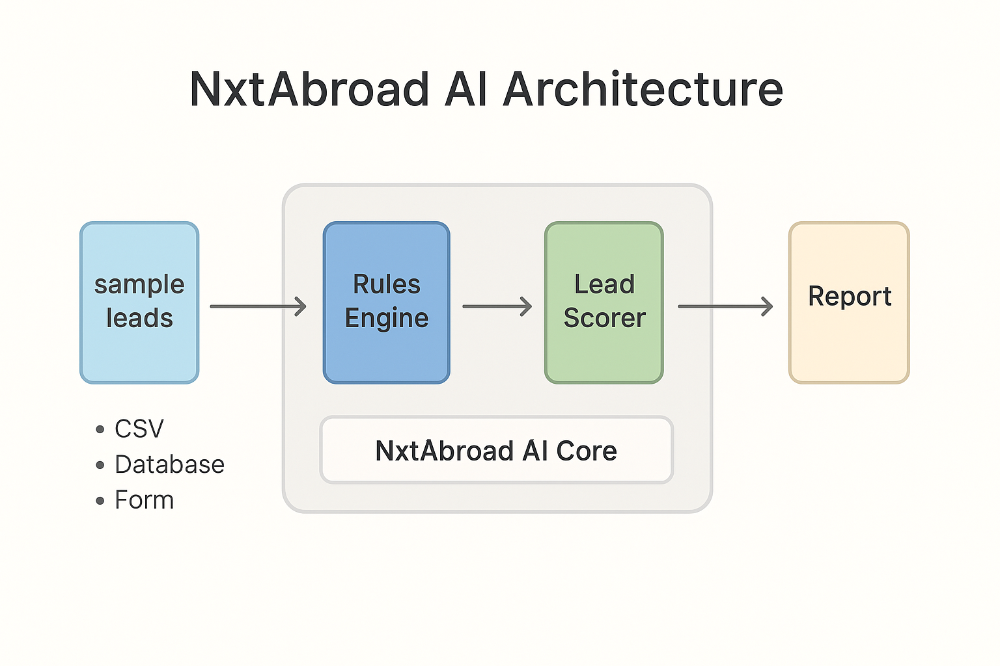
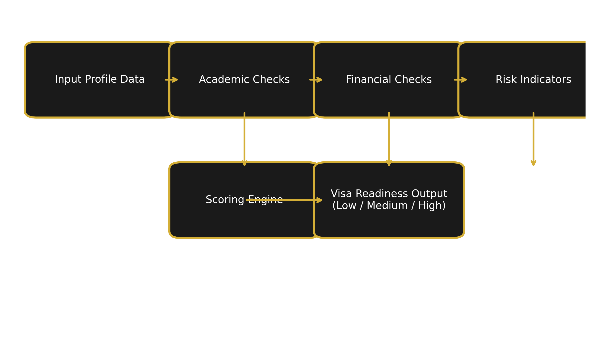

# NxtAbroad AI – Visa Readiness Scoring Engine

## Overview

NxtAbroad AI is a machine-learning project that predicts the **visa readiness** of international student applications and flags **high-risk cases** before submission.

It is designed as an internal decision-support tool for **NxtAbroad Limited**, and as a demonstrable AI product for **Global Talent / Tech Nation** evidence.

The system takes structured applicant data (age, country, course, proof of funds, study gap, visa history, etc.) and outputs a **readiness class**:

- `0` – High Risk  
- `1` – Medium Risk  
- `2` – Ready  

## Project Goals

- Provide a **consistent, data-driven assessment** of visa readiness.
- Highlight key risk factors such as **weak funds, short fund duration, gaps, or poor documentation**.
- Support NxtAbroad consultants to **prioritise and improve** applications.
- Serve as a **flagship AI project** in Ibrahim Akinyera’s portfolio.

## Data

The current version uses a **synthetic dataset** that approximates real-world patterns in student visa applications.

- Script: `src/generate_synthetic_data.py`
- Output: `data/processed/visa_readiness_data.csv`

Key feature groups:

- Demographics (age, citizenship, country of residence)
- Education and course details
- Financial capacity (tuition, deposit, proof of funds, funds held days)
- Visa and travel history
- Employment and study gaps
- Documentation quality

Target variable: `visa_readiness_class` (0, 1, 2).

## Model

The baseline model is a **Random Forest classifier** wrapped in a Scikit-learn pipeline with:

- Numeric preprocessing: imputation + scaling  
- Categorical preprocessing: imputation + one-hot encoding  

Script: `src/train_model.py`  
Saved model: `models/visa_readiness_model.joblib`
## Evidence for Tech Nation (Digital Technology)

This project is submitted as **Evidence 1: Mandatory Criterion**, demonstrating:

- Innovation in building a product-led AI engine  
- Technical leadership as the **Founder of NxtAbroad Limited**  
- Ability to design a functional decision system used in real-world operations  
- Impact across a growing UK–Nigeria EdTech company  

Download Evidence PDF:  
**[Evidence_1_NxtAbroad_AI_Ibrahim_Akinyera.pdf](./Evidence_1_NxtAbroad_AI_Ibrahim_Akinyera.pdf)**

---

## Architecture Diagram



---

## Scoring Flow Example



---

## Author

**Ibrahim Akintunde Akinyera**  
Founder – NxtAbroad Limited  
Machine Learning Engineer | Cybersecurity & Risk Analytics  
Portfolio: https://akinyeraakintunde.github.io/Ibrahim-Akinyera
## How to Run

```bash
# 1. Create and activate a virtual environment (optional but recommended)

pip install -r requirements.txt

# 2. Generate synthetic data
python src/generate_synthetic_data.py

# 3. Train and evaluate the model
python src/train_model.py

---

